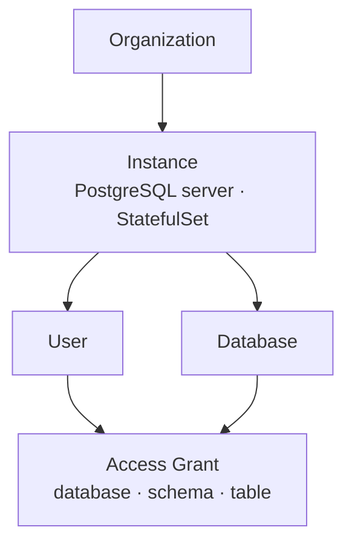
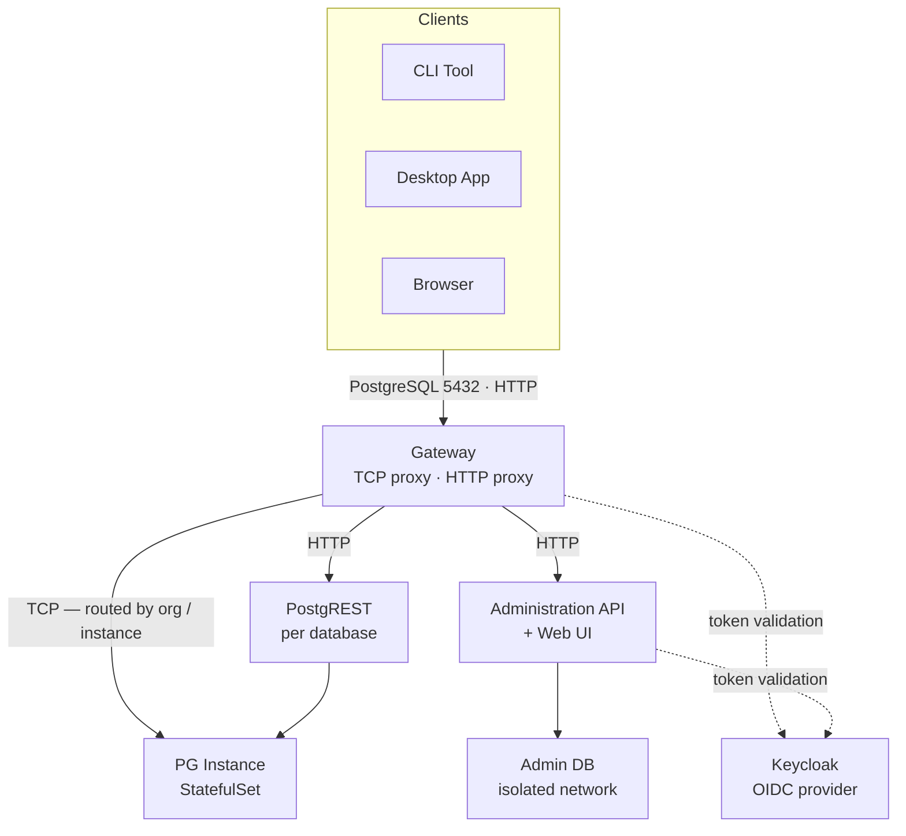

# PG Farm

A managed PostgreSQL hosting platform with scale-to-zero instances, OIDC-based
authentication, and automatic REST API generation.

**Live deployment:** https://pgfarm.library.ucdavis.edu

## Overview

PG Farm manages a cluster of PostgreSQL instances running in Kubernetes.
Each instance is a PostgreSQL server (a Kubernetes StatefulSet) that can host
multiple databases. PG Farm tracks query activity across databases and scales
instances to zero when idle — deleting the StatefulSet but retaining the
persistent volume — then scales them back up automatically when a client
connects. This allows a large number of infrequently used databases to share a
cluster without holding compute resources for idle instances.

Access is unified through a single gateway that accepts both PostgreSQL wire
protocol connections and HTTP traffic. Authentication is handled via OIDC,
letting users connect to databases with tokens issued against an external
identity provider rather than managing separate database passwords.

## Core Concepts



### Organizations

An organization is the top-level grouping in PG Farm. Organizations own
instances and databases. Administration and access control are scoped to
organizations.

### Instances

An instance is a PostgreSQL server managed as a Kubernetes StatefulSet. A
single instance runs one PostgreSQL process and can host multiple databases.
Users are provisioned at the instance level — a user must exist on an instance
before they can be granted access to any database within it. Instances are the
unit of scale-to-zero behavior.

Because all user instances share a network within the cluster, PostgreSQL
[Foreign Data Wrappers](https://www.postgresql.org/docs/current/postgres-fdw.html)
can be used to query across instances directly — a useful pattern for joining
local data against well-known public datasets hosted on other instances.

### Databases

A database is a standard PostgreSQL database hosted within an instance. Users
and tools connect to a specific database through the PG Farm gateway. Each
database can optionally expose one of its schemas as an HTTP REST API via
PostgREST.

### Users and Access Control

Users authenticate through an external OIDC provider and do not manage
PostgreSQL passwords directly. PG Farm maps OIDC identities to PostgreSQL
users on each instance. Grants control what a user can do within a specific
database or schema and are managed through the web UI, CLI, or Administration
API.

### PostgREST

PG Farm can attach a [PostgREST](https://postgrest.org) instance to a
database, auto-generating an HTTP REST API from a selected PostgreSQL schema.
PostgREST is configured per database and per schema. The generated API is
accessible through the same HTTP gateway as the rest of PG Farm and uses the
same authentication model.

## Architecture



All client traffic — PostgreSQL wire protocol and HTTP — enters through the
**Gateway**. PostgreSQL connections are routed to the correct **PG Instance**
based on the organization and instance path. HTTP traffic is routed to either
the **Administration API** (platform management and web UI) or **PostgREST**
(database REST APIs), both reachable through the same HTTP proxy. Platform
metadata is stored in a dedicated **Admin DB** on an isolated network within
the cluster. **Keycloak** (or any OIDC-compatible provider) handles identity;
PG Farm validates tokens at the gateway and API layers.

## Components

### Administration API

The control plane service. It exposes a REST API for managing organizations,
instances, databases, users, and access grants. It handles OIDC token
validation and issues database-scoped credentials so that tools like `psql`
and standard PostgreSQL client libraries can authenticate without managing
separate database passwords. Platform state is stored in a dedicated PostgreSQL
database on an isolated internal network, separate from user instances.

### Gateway

The single network entry point for all PG Farm traffic. The gateway runs two
listeners:

- **TCP proxy (port 5432):** Accepts PostgreSQL wire protocol connections and
  validates the JWT-derived token supplied as the database password before
  routing to the correct instance. If the target instance is scaled to zero,
  the gateway triggers a scale-up and holds the connection open until the
  instance is ready. Connections already established when an instance goes
  offline are also held open and resumed when the instance returns.
- **HTTP proxy:** Routes browser and API traffic to the Administration API or
  PostgREST based on request path.

The gateway also enforces IP CIDR deny-list filtering.

### Web UI

A single-page application built with [Lit](https://lit.dev) web components
and the [UC Davis Design System](https://designsystem.ucdavis.edu). The web
UI serves two primary purposes:

- **Discovery:** Browse and search databases you have access to, view
  connection details, and generate connection snippets for psql, common
  programming languages, and data tools.
- **Access Control:** Manage user grants at the database and schema level, add
  and remove users from instances, and administer organizations.

### PostgREST

[PostgREST](https://postgrest.org) auto-generates an HTTP REST API from a
PostgreSQL schema. PG Farm manages a PostgREST process per database when
enabled, generates its configuration, and routes requests to it through the
HTTP gateway. The API reflects the schema's tables, views, and functions and
respects PostgreSQL row-level security policies. PostgREST validates the same
JWTs issued by the Administration API, so the same token a user receives at
login works across PostgreSQL wire connections and HTTP API requests alike.

### CLI Tool

A Node.js command-line tool installed via npm:

```bash
npm install -g @ucd-lib/pgfarm
```

The CLI handles authentication, database discovery, connection configuration,
and administrative operations. It writes a PostgreSQL service file so that
`psql` and libpq-based clients can connect using `PGSERVICE=pgfarm` without
managing credentials directly.

```bash
# Authenticate
pgfarm auth login

# Connect with psql
PGSERVICE=pgfarm psql [database-name]

# Show connection examples for other tools and languages
pgfarm connect --help

# Show authentication options
pgfarm auth --help
```

### Desktop Application

An Electron-based desktop application providing a GUI equivalent of the CLI.
Available for Windows, macOS (Intel and Apple Silicon), and Linux. Binaries
are built and distributed via GitHub Actions.

### Health Probe and PG Helper

**Health Probe** is a lightweight service that monitors PostgreSQL instance
availability and reports status back to the platform.

**PG Helper** is a background daemon that handles scheduled tasks including
automated database backups to Google Cloud Storage.

## Scale-to-Zero

PG Farm tracks query activity per database using connection and query counters.
As a database goes without activity, its disruption budget increases
incrementally. Once all databases on an instance have exhausted their budgets,
PG Farm deletes the Kubernetes StatefulSet for that instance. The persistent
volume — and all data — is retained. When a client next connects through the
gateway, PG Farm recreates the StatefulSet and holds the connection open until
the instance is healthy and ready to accept queries.

Connections that are active when an instance is taken offline are also held
open by the gateway and resumed transparently when the instance comes back.

This allows PG Farm to host many infrequently accessed databases in a shared
Kubernetes cluster without reserving compute for idle instances.

## Authentication

PG Farm uses OIDC (OpenID Connect) for all authentication. The UC Davis
Library deployment uses Keycloak as the identity provider.

After a user authenticates, the Administration API issues a short-lived JWT
scoped to the user's database access. A compact identifier derived from that
JWT — a short SHA — is then used as the PostgreSQL password. Standard
PostgreSQL clients (psql, libpq, drivers) pass this value through the normal
password field without any modification. The gateway's TCP proxy intercepts
the PostgreSQL authentication handshake, extracts and validates the token
before the connection ever reaches the instance, and rejects unauthenticated
or expired sessions at the wire level.

The CLI writes a PostgreSQL service file pre-populated with the token so that
tools connect transparently. PostgREST endpoints validate the same JWTs via
the HTTP Authorization header.

Users never set or manage PostgreSQL-level passwords directly.

## Technology Stack

| Layer | Technology |
|---|---|
| Backend runtime | Node.js 20 |
| API framework | Express |
| Database | PostgreSQL 16 |
| Database driver | node-postgres (`pg`) |
| Authentication | OIDC — Keycloak, `express-openid-connect` |
| REST layer | PostgREST v12 |
| Observability | OpenTelemetry + Google Cloud Monitoring |
| Web components | Lit v3 |
| Design system | UC Davis Design System |
| CLI framework | Commander |
| Desktop app | Electron |
| Container orchestration | Kubernetes (GKE) + Kustomize |
| CI/CD | Google Cloud Build, GitHub Actions |
| Backups | Google Cloud Storage |

## Deployment

PG Farm runs on Kubernetes and requires a PostgreSQL database for its admin
store and an external OIDC provider. Deployment documentation lives in
[docs/](./docs/).

## License

[MIT](./LICENSE)
